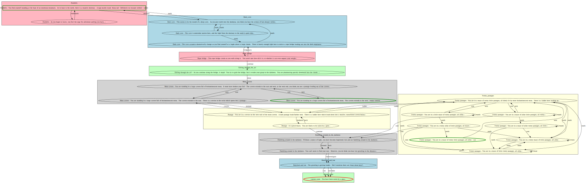
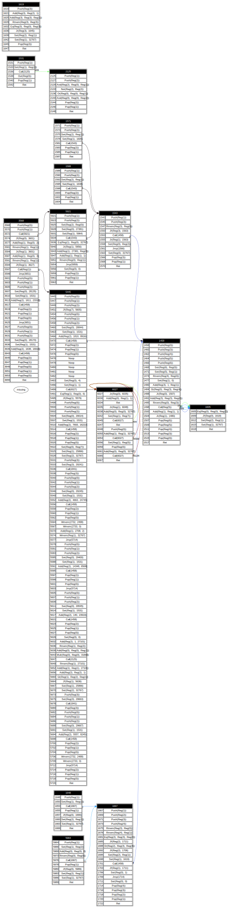

# Intro
Synacor Challenge is a hacking/programming challenge where you code an interpreter for a VM, then execute a program leading to more challenges

The VM specs are [here](./arch-specs)

The program is [here](./challenge.bin)

The official site is down (https://challenge.synacor.com/)

But you can validate codes via https://github.com/Aneurysm9/vm_challenge

# Simple instructions

Implementing the first instructions `Noop`, `Out` and `Halt` will display the welcome message

```
Welcome to the Synacor Challenge!
Please record your progress by putting codes like
this one into the challenge website: hKRuXKPwTwlo
```

# Self test

Implement the remaining instruction to complete the self-test

```
Executing self-test...

self-test complete, all tests pass
The self-test completion code is: NhMSeBfjuEsD
```

# Tablet

We are now in some kind of text-based game

In Foothills (first room)

```
Things of interest here:
- tablet
```

```
$ i take tablet

Taken.
```

```
$ i use tablet


You find yourself writing "jtQUShZPqyoL" on the tablet.  Perhaps it's some kind of code?
```

# Maze

Trying to explore the world is difficult, as there is a lot of rooms.

A graph traversal algorithm combined with Graphviz can create a nice map. Also the state loader/saver is useful to save time.

- Green: room with items
- Red: VM state == Halted



Grab empty lantern and can

```
$ i use can

You fill your lantern with oil.  It seems to cheer up!
```

Find a message in a room

```
Chiseled on the wall of one of the passageways, you see:

    VdfKGsbnhQYK
```

Go to the dark passage (2 times west)

# Ruins

We reuse the graph explorer to get a new map for the Ruins


Problem statement

```
You stand in the massive central hall of these ruins.  The walls are crumbling, and vegetation has clearly taken over.  Rooms are attached in all directions.  There is a strange monument in the center of the hall with circular slots and unusual symbols.  It reads:

_ + _ * _^2 + _^3 - _ = 399
```

Grab the coins in different rooms

```
This coin is made of a blue metal.  It has nine dots on one side.
This coin is made of a red metal.  It has two dots on one side.
This coin is somehow still quite shiny.  It has a pentagon on one side.
This coin is slightly rounded, almost like a tiny bowl.  It has seven dots on one side.
This coin is somewhat corroded.  It has a triangle on one side.
```

Permutations solver:

```
use itertools::Itertools;

fn main() {
    let list = [2i32, 3, 5, 7, 9];
    
    for x in list.iter().permutations(5) {
        if x[0] + x[1] * x[2].pow(2) + x[3].pow(3) - x[4] == 399 {
            dbg!(x);
        }
    }
}
```

Solution:

```
[src/main.rs:8:13] x = [
    9,
    2,
    5,
    7,
    3,
]
```

```
You place the corroded coin into the leftmost open slot.
As you place the last coin, you hear a click from the north door.

$ i north

== Ruins ==
Because it has been so well-protected, this room hardly shows signs of decay.  The walls are covered in elaborate murals and decorated with precious metals and stones.

Things of interest here:
- teleporter

$ i use teleporter


You activate the teleporter!  As you spiral through time and space, you think you see a pattern in the stars...

    yjdhyEgpXPgW

After a few moments, you find yourself back on solid ground and a little disoriented.
```

# Synacor Headquarters

The `strange book` gives some guidelines

```
The cover of this book subtly swirls with colors.  It is titled "A Brief Introduction to Interdimensional Physics".  It reads:

Recent advances in interdimensional physics have produced fascinating
predictions about the fundamentals of our universe!  For example,
interdimensional physics seems to predict that the universe is, at its root, a
purely mathematical construct, and that all events are caused by the
interactions between eight pockets of energy called "registers".
Furthermore, it seems that while the lower registers primarily control mundane
things like sound and light, the highest register (the so-called "eighth
register") is used to control interdimensional events such as teleportation.

A hypothetical such teleportation device would need to have have exactly two
destinations.  One destination would be used when the eighth register is at its
minimum energy level - this would be the default operation assuming the user
has no way to control the eighth register.  In this situation, the teleporter
should send the user to a preconfigured safe location as a default.

The second destination, however, is predicted to require a very specific
energy level in the eighth register.  The teleporter must take great care to
confirm that this energy level is exactly correct before teleporting its user!
If it is even slightly off, the user would (probably) arrive at the correct
location, but would briefly experience anomalies in the fabric of reality
itself - this is, of course, not recommended.  Any teleporter would need to test
the energy level in the eighth register and abort teleportation if it is not
exactly correct.

This required precision implies that the confirmation mechanism would be very
computationally expensive.  While this would likely not be an issue for large-
scale teleporters, a hypothetical hand-held teleporter would take billions of
years to compute the result and confirm that the eighth register is correct.

If you find yourself trapped in an alternate dimension with nothing but a
hand-held teleporter, you will need to extract the confirmation algorithm,
reimplement it on more powerful hardware, and optimize it.  This should, at the
very least, allow you to determine the value of the eighth register which would
have been accepted by the teleporter's confirmation mechanism.

Then, set the eighth register to this value, activate the teleporter, and
bypass the confirmation mechanism.  If the eighth register is set correctly, no
anomalies should be experienced, but beware - if it is set incorrectly, the
now-bypassed confirmation mechanism will not protect you!

Of course, since teleportation is impossible, this is all totally ridiculous.
```


reg7 = 1
instructions limit = 1.000.000.000

```
$ i use teleporter


A strange, electronic voice is projected into your mind:

  "Unusual setting detected!  Starting confirmation process!  Estimated time to completion: 1 billion years."
```

(emulator hangs for 30s, takes 20 GiB of RAM for the stack...)

Instrumenting the VM to count specific instructions shows that some functions are called a LOT. If we limit the number of instructions to run, we note that the following calls grow with this limit

Functions call graph




Most called functions

```
  (
        calls: 5548,
        ip: 6045,
        Call(
            6027,
        ),
    ),
    (
        calls: 7687327,
        ip: 6065,
        Call(
            6027,
        ),
    ),
    (
        calls: 7692592,
        ip: 6054,
        Call(
            6027,
        ),
    ),
```

Reimplement fn 6027 in rust
Increase stack size to 32 MiB

Now setting fn_patching = true
After < 0.01s

```
A strange, electronic voice is projected into your mind:

  "Miscalibration detected!  Aborting teleportation!"

Nothing else seems to happen.
```

Now bute force register values


We find the solution : 25734

```
$ vm register set 7 25734
$ vm fn_patching true
fn_patching: ✔️
$
$ i use teleporter


A strange, electronic voice is projected into your mind:

  "Unusual setting detected!  Starting confirmation process!  Estimated time to completion: 1 billion years."

You wake up on a sandy beach with a slight headache.  The last thing you remember is activating that teleporter... but now you can't find it anywhere in your pack.  Someone seems to have drawn a message in the sand here:

    lVfSqITLZkYK

It begins to rain.  The message washes away.  You take a deep breath and feel firmly grounded in reality as the effects of the teleportation wear off.       

```

# Beach
